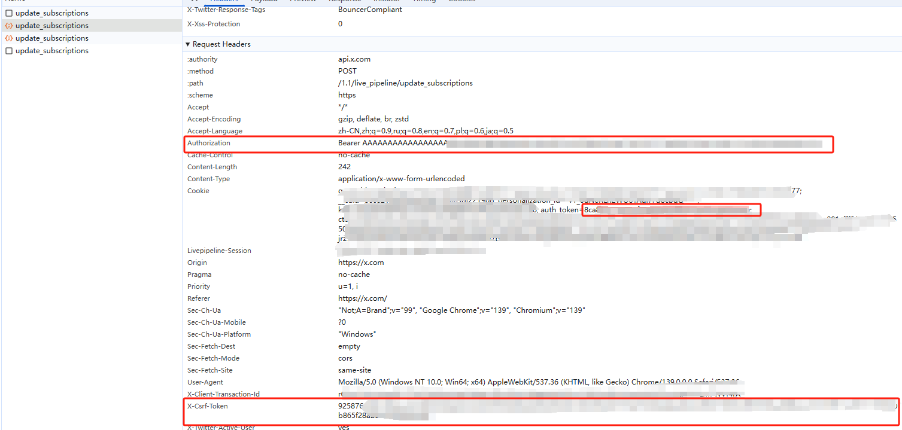

## 开始使用

项目基于 Java 17 开发，请先确保你的环境已安装 JDK17 和 Maven。


## API文档

项目启动成功后，访问 `http://localhost:10010/doc.html` 即可查看 API 文档。

## 请求接口

**接口地址**:`http://localhost:10010/parser/executor`

**请求方式**:`POST`

**请求数据类型**:`application/json`

**响应数据类型**:`application/json`

**请求参数**:

| 参数名称 | 参数说明 | 请求类型    | 是否必须 | 数据类型 | schema |
| -------- | -------- | ----- | -------- | -------- | ------ |
|url|视频链接||true|string||

**响应状态**:

| 状态码   | 说明   | schema |
|-------|------| ----- | 
| 200   | OK   |ResultParserResp|
| 10003 | 不支持的解析器 |ResultParserResp|
| 10004 | 解析失败 |ResultParserResp|
| 10005 | 未解析到媒体资源 |ResultParserResp|
| 10006 | 获取视频ID失败 |ResultParserResp|
| 10007 | 获取视频信息失败 |ResultParserResp|
| 10008 | 解析媒体信息失败 |ResultParserResp|
| 10009 | 获取真实地址失败 |ResultParserResp|
| 10010 | Cookie过期 |ResultParserResp|

**响应参数**:

| 参数名称 | 参数说明 | 类型 | schema |
| -------- | -------- | ----- |----- | 
|code|业务错误码|integer(int32)|integer(int32)|
|msg|信息描述|string||
|data||ParserResp|ParserResp|
|&emsp;&emsp;title|视频标题|string||
|&emsp;&emsp;author||Author|Author|
|&emsp;&emsp;&emsp;&emsp;nickname|昵称|string||
|&emsp;&emsp;&emsp;&emsp;avatar|头像|string||
|&emsp;&emsp;cover|封面|string||
|&emsp;&emsp;medias|媒体资源|array|Media|
|&emsp;&emsp;&emsp;&emsp;type|类型(VIDEO->视频,IMAGE->图集,LIVE->实况),可用值:VIDEO,IMAGE,LIVE|string||
|&emsp;&emsp;&emsp;&emsp;url|地址|string||
|&emsp;&emsp;&emsp;&emsp;resolution|分辨率|string||


**响应示例**:
```json
{
	"code": 0,
	"msg": "",
	"data": {
		"title": "",
		"author": {
			"nickname": "",
			"avatar": ""
		},
		"cover": "",
		"medias": [
			{
				"type": "",
				"url": "",
				"resolution": ""
			}
		]
	}
}
```

## 账号配置

推特解析需要在 `application-${spring.profiles.active}.yml` 文件中配置 Twitter 账号信息。

```yaml
# 平台账号设置
account:
  # 推特账号设置
  twitter:
    # cookie.auth_token
    auth_token: 必填
    # header.x-csrf-token
    x_csrf_token: 必填
    # header.authorization
    authorization: 必填
```

### 获取推特账号信息

1. 首先需要在浏览器登录Twitter账号。
2. `F12` 或 `Ctrl+Shift+I` 打开开发者工具，选择`Network`标签。
3. `F5` 或 `Ctrl+R` 刷新页面。
4. 在`Network`标签中，`Ctrl+F` 搜索 `live_pipeline/update_subscriptions`。
5. 点击 `live_pipeline/update_subscriptions`，在 `Request Headers` 标签，找到 `x-csrf-token`、`Cookie`、`Authorization` 参数，复制上方yaml中需要的参数值并将其填入配置文件中。



## 代理配置

在解析部分平台时需要国外网络环境，需要在 `application-${spring.profiles.active}.yml` 中配置代理信息。

```yaml
forest:
  proxy:
    # 启用后仅在请求国外站点时才启用代理(本机是国外网络环境则不需要启用)
    enable: true
    # http or socks (docs:https://forest.kim/pages/1.7.x/api_proxy/)
    type: http
    host: 127.0.0.1
    port: 7890
    # username:
    # password:
```